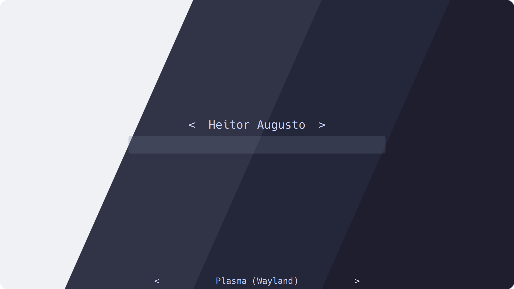
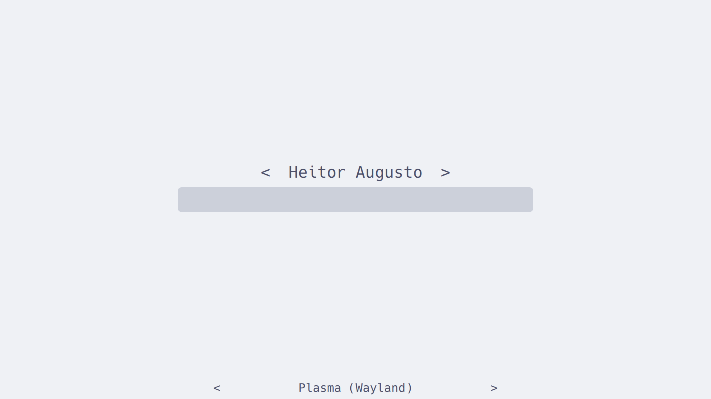
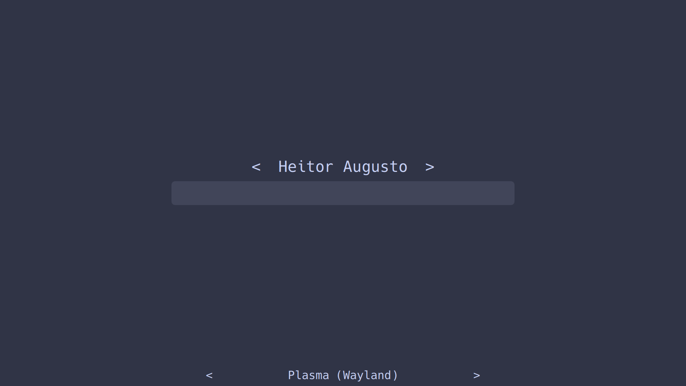
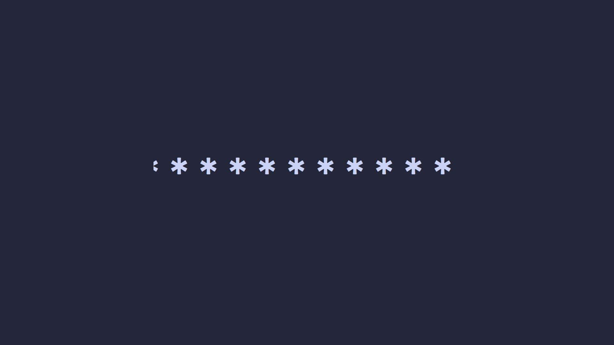
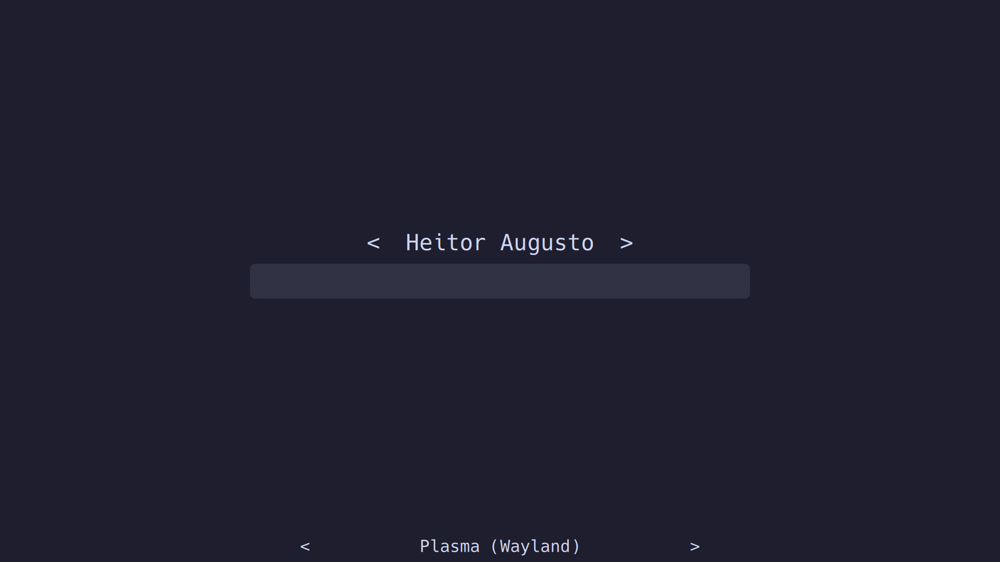

<h3 align="center">
	<br/>
	
	Catppuccin for <a href="https://github.com/stepanzubkov/where-is-my-sddm-theme">Where is my SDDM theme?</a>
	
</h3>

<p align="center">
	<a href="https://github.com/catppuccin/where-is-my-sddm-theme/stargazers"></a>
	<a href="https://github.com/catppuccin/where-is-my-sddm-theme/issues"></a>
	<a href="https://github.com/catppuccin/where-is-my-sddm-theme/contributors"></a>
</p>

<p align="center">
	
</p>

## Previews

<details>
<summary>🌻 Latte</summary>

</details>
<details>
<summary>🪴 Frappé</summary>

</details>
<details>
<summary>🌺 Macchiato</summary>

</details>
<details>
<summary>🌿 Mocha</summary>

</details>

## Usage

1. Download the flavor of your choice.
2. Rename the file to either `theme.conf` or `theme.conf.user`.
3. Move the selected flavor file to `/usr/share/sddm/themes/where_is_my_sddm_theme` or `~/.local/share/sddm/themes/where_is_my_sddm_theme`.

## Customization

This theme is built with [Whiskers](https://github.com/catppuccin/whiskers).

If you wish to hide the cursor in the theme, you can override it as follows:

```console
whiskers where-is-my-sddm-theme.tera --overrides '{"hideCursor": true}'
```

Reinstall the rebuilt theme as described in [Usage](#usage).

For more extensive changes you can edit [where-is-my-sddm-theme.tera](./where-is-my-sddm-theme.tera) to change the theme variables and rebuild with `whiskers where-is-my-sddm-theme.tera`.

## 💝 Thanks to

- [HeitorAugustoLN](https://github.com/HeitorAugustoLN)

&nbsp;

<p align="center">
	
</p>

<p align="center">
	Copyright &copy; 2021-present <a href="https://github.com/catppuccin" target="_blank">Catppuccin Org</a>
</p>

<p align="center">
	<a href="https://github.com/catppuccin/catppuccin/blob/main/LICENSE"></a>
</p>
